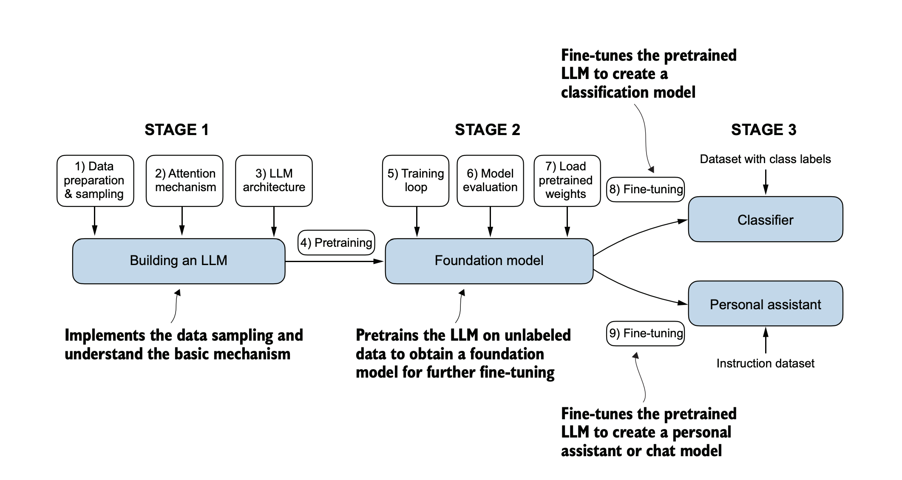

# LLM

LLMs have remarkable capabilities to **understand, generate, and interpret human language**.They ushered in a new era for natural language processing **(NLP)**. LLMs have significantly improved performance in a wide
range of NLP tasks, including text translation, sentiment analysis, question answering, and many more.

Since LLMs are capable of generating text, LLMs are also often referred to as a form
of generative artificial intelligence, often abbreviated as generative AI or GenAI.

The success behind LLMs can be attributed to the transformer architecture that
underpins many LLMs and the vast amounts of data on which LLMs are trained,
allowing them to capture a wide variety of linguistic nuances, contexts, and patterns
that would be challenging to encode manually.

The **“large”** in **“large language model”** refers to both the model’s size in terms of parameters and the immense dataset on which it’s trained. Models like this often have
**tens or even hundreds of billions of parameters**, which are the adjustable weights in
the network that are optimized during training to predict the next word in a sequence.

LLMs utilize an architecture called the **transformer**, which allows them to pay selective attention to different parts of the input when making predictions, making them
especially adept at handling the nuances and complexities of human language.

