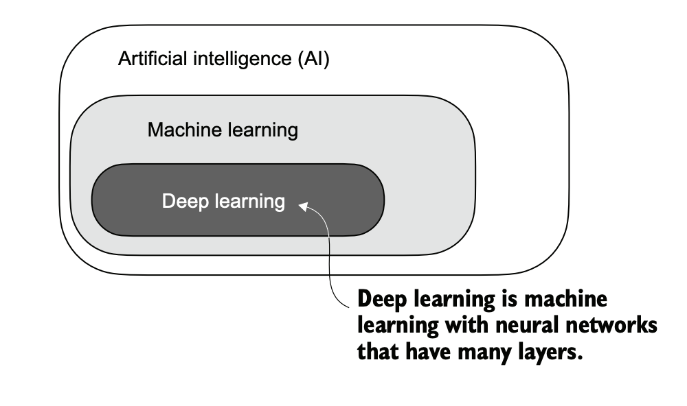
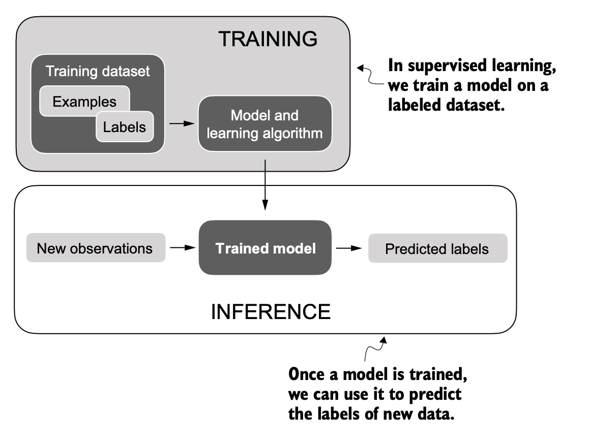

# Machine Learning

Machine learning represents a subfield of AI. The key idea behind machine learning is to enable computers to learn from data and make predictions or decisions without being explicitly programmed to perform the task. This involves developing algorithms that can identify patterns, learn from historical data, and improve their performance over time with more data and feedback.

**Machine learning** is also behind technologies like recommendation systems used by online retailers and streaming services, email spam filtering, voice recognition in virtual assistants, and even self-driving cars.

**Deep learning **is a subcategory of machine learning that focuses on the training and application of deep neural networks. These deep neural networks were originally inspired by how the human brain works, particularly the interconnection between many neurons. The “deep” in deep learning refers to the multiple hidden layers of artificial neurons or nodes that allow them to model complex, nonlinear relationships in the data. Unlike traditional machine learning techniques that excel at simple pattern recognition, deep learning is particularly good at handling unstructured data like images, audio, or text, so it is particularly well suited for LLMs.

