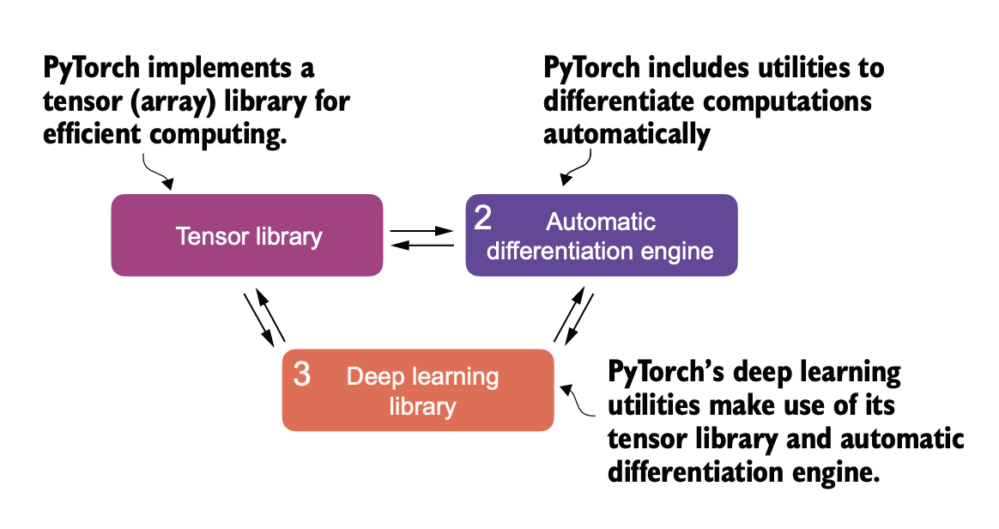
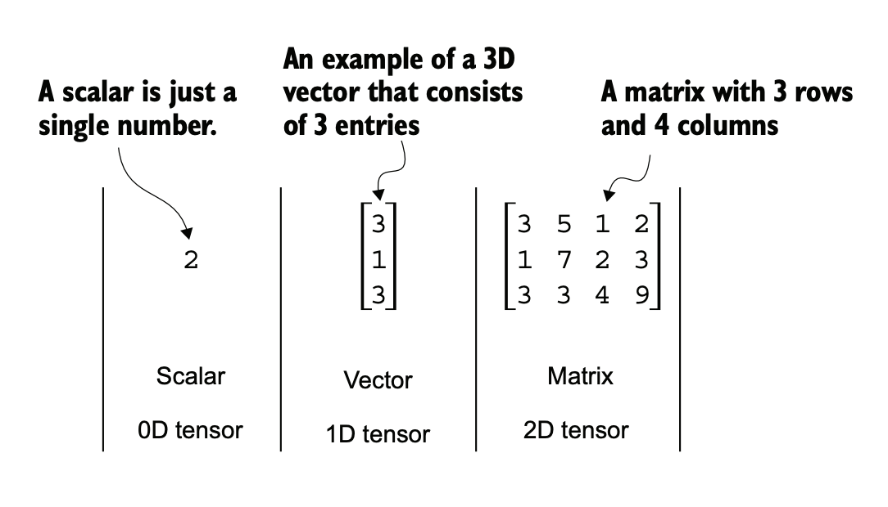

# PyTorch

PyTorch (https://pytorch.org/) is an open source Python-based deep learning library.



1. PyTorch is a tensor library that extends the concept of the array-oriented programming library NumPy with the additional feature that accelerates computation on GPUs, thus providing a seamless switch between CPUs and GPUs.

2. PyTorch is an automatic differentiation engine, also known as autograd, that enables the automatic computation of gradients for tensor operations, simplifying backpropagation and model optimization

3. PyTorch is a deep learning library. It offers modular, flexible, and efficient building blocks, including pretrained models, loss functions, and
optimizers, for designing and training a wide range of deep learning models, catering
to both researchers and developers.  

> LLMs are also a type of deep neural network, and PyTorch is a deep learning library.  

there are two versions of PyTorch: a leaner version that only supports CPU computing and a full version that supports both CPU and GPU computing. If your machine has a CUDA-compatible GPU that can be used for deep learning (ideally, an NVIDIA T4, RTX 2080 Ti, or newer), I recommend installing the GPU version.  

## 1. Pytorch Installation

```sh
pip install torch

# Specific version
pip install torch==2.4.0
```

### check installed version

```python
import torch
torch.__version__
```

### Check GPU Availability

```py
import torch
torch.cuda.is_available()

#True, if available
```

## 2. Understanding tensors

Tensors represent a mathematical concept that generalizes vectors and matrices to potentially higher dimensions. In other words, tensors are mathematical objects that can be characterized by their order (or rank), which provides the number of dimensions.  
*From a computational perspective,*  

- tensors serve as data containers.  
- For instance, they hold multidimensional data, where each dimension represents a different feature.
- Tensor libraries like PyTorch can create, manipulate, and compute with these arrays efficiently.
- In this context, a tensor library functions as an array library.  

### Scalars, vectors, matrices, and tensors



in above figure,  

- a scalar (just a number) is a tensor of rank 0
- a vector is a tensor of rank 1
- a matrix is a tensor of rank 2

 

*PyTorch tensors are similar to NumPy arrays* but have several additional features that are important for deep learning. For example, PyTorch adds an automatic differentiation engine, simplifying computing gradients. PyTorch tensors also support GPU computations to speed up deep neural network training.  
*PyTorch tensors are data containers for array-like structures.*

- A scalar is a zero-dimensional tensor (for instance, just a number)
- a vector is a onedimensional tensor, and a matrix is a two-dimensional tensor.  
- There is no specific term for higher-dimensional tensors, so we typically refer to a three-dimensional tensor as just a 3D tensor, and so forth.

```python
import torch
#0D
tensor0d = torch.tensor(1)
#1D
tensor1d = torch.tensor([1, 2, 3])
#2D
tensor2d = torch.tensor(
    [
        [1,2],
        [3,4]
    ]
)
#3D
tensor3d = torch.tensor(
    [
        [
            [1,2],
            [3,4]
        ],
        [
            [5,6],
            [7,8]
        ]
    ]
)
```

PyTorch adopts the default 64-bit integer data type from Python. We can access the data type of a tensor via the .dtype attribute of a tensor

```py
tensor1d = torch.tensor([1, 2, 3])
print(tensor1d.dtype)
# torch.int64

floatvec = torch.tensor([1.0, 2.0, 3.0])
print(floatvec.dtype)
# torch.float32

#change the precision using a tensor’s .to method
floatvec = tensor1d.to(torch.float32)
print(floatvec.dtype)
#torch.float32
```

### Common operations

```py
tensor2d = torch.tensor(
    [
        [1, 2, 3],
        [4, 5, 6]
    ]
)

print(tensor2d)
# tensor([[1, 2, 3],[4, 5, 6]])

```
