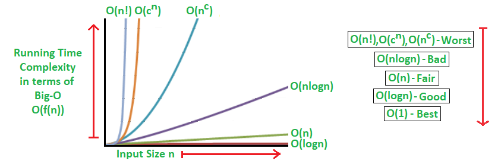

# Javascript Algorithms

The absolute running time of an algorithm cannot ne preddicted, since it depends on **the progaramming language**, **the computer program runs on**, **other program runs at the same time**, **Quality of OS**, ...  

**Points to note**:

- Multiple algorithms exist for the same problem and there is no one right solution. Different algorithms work well under different constraints
- The same algoritm with the same programming language can be implemented in multiple ways.
- Rather than writing cleaver code, write code that is simple to read and easy to maintain.

## Complexity Analysis

Complexity Analysis determines the amount of time and space resources required to execute it.It is used for comparing different algorithms on different input sizes.
Complexity helps to determine the difficulty of a problem. often measured by how much time and space (memory) it takes to solve a particular problem

Usually, we evaluate the performance of an algorithm in terms of its input size. This approach makes the analysis machine-independent and allows for more meaningful comparisons across different algorithms.


> There is no single solution that works every time. It's important to have multiple approaches to solving a problem and choose the best one based on the specific constraints at hand.

`Time Complexity`: Amount of **time** taken by an algorithm to run, as a function of input. Note that the time to run is a **function of the length of the input and not the actual execution time of the machine** on which the algorithm is running on.  

`Space Complexity`: Amount of **memory** taken by an algorithm to run, as a function of input.Problem-solving using a **computer requires memory to hold temporary data or final result** while the program is in execution.

## Representation of Complexity

### Asymptotic Notations

*Asymptotic Notations* are tools to represent time and space complexity.

#### 1. Big O Notation (O) - worstcase complexity

- it expressed in terms of input  
- it focuses on big picture without getting caught up in the minute details.
- Represents the upper bound of an algorithm's running time, indicating its worst-case complexity.
- Big O notation asymptotically limits running time to a range of constant factors.
- It provides a model for quantifying algorithm performance.  
- Big O notation describes the algorithm using algenric terms.  
`O(1)` : Constant complexity.  
`O(n)` : Linear complexity.  
`O(n*m)` : Quadratic complexity.  
`O(logn)` : Logarithmic complexity: input size reduces by half in every iteration  

- Reference: [bigocheatsheet](https://www.bigocheatsheet.com/)  



#### 2. Omega Notation (Ω) - Best case complexity

- Omega notation represents the lower bound of the running time of an algorithm.Thus, it provides the best-case complexity of an algorithm.
- It is defined as the condition that allows an algorithm to complete statement execution in the shortest amount of time.

#### 3. Theta Notation (Θ) - Average case complexity

- Theta notation encloses the function from above and below.
- Since it represents the upper and the lower bound of the running time of an algorithm, it is used for analyzing the average-case complexity of an algorithm

---

*In practice, there's no need to focus too much on the best or average case complexities. We **primarily consider the worst-case scenario of an algorithm**, as it provides a more reliable measure of its performance under any conditions.*

---

## Big O Time Complexity

```javascript
function summation(n){
    let sum = 0 //O(1)
    for(let i=1: i<=n; i++){
        sum+=i //O(n)
    }
    return sum //O(1)
}

```

*from above example*  
total time complexity = O(1) + O(n) + O(1) ==> O(n+2)

n | Big O
---|---
n=10 | O(10+2)  
n=100 | O(100+2)  
n=1000 | O(1000+2)  
n | O(n+2)

The constant value 2 is very insignificant while considering the big picture. So we can drop the constants. ie, *O(n+2)  ==>  O(n)*.  
`O(n) - Linear`: As the input size increases, the complexity increases proportionally.

---

*examples*:  

```javascript
function summation(n){
    return (n*(n+1))/2    //O(1)
}
```

---

```javascript
function loop(){
    for(let i=1: i<=n; i++){
        for(let j=1: j<=n; j++){
            
        }
    } 
}
// O(n)*O(n) ==>  O(n^2)
```

```javascript
function loop(){
    for(let i=1: i<=n; i++){
        for(let j=1: j<=n; j++){
            for(let k=1: k<=n; k++){
            
        }
        }
    } 
}
// O(n)*O(n)*O(n) ==> O(n^3)
```

```javascript
function loop(){
    for(let i=1: i<=n; i++){

    } 
    for(let j=1: j<=n; j++){
        
    }
}
// O(n)+O(n) ==> O(n)
```

### Objects - Big O

---

An object is a collection of key value pairs.  

```javascript
const person = {
    name: "xyz"
    age: 28
}
```

- `insert`: O(1)
- `remove`: O(1)
- `access`: O(1)
- `search`: O(n)
- Object.keys() - O(n)
- Object.values() - O(n)
- Object.entries() - O(n)

### Arrays - Big O

---

An array is an ordered collection of values.  

```javascript
const number = [1,2,3,4,5,6,7]
```

- `insert/remove at the end`: O(1)
- `insert/remove at the begnning`: O(n), because the index needs to be reseted for every elements in the array.
- `access` - O(1)
- `search`: O(n)
- Array.push() - O(1)
- Array.pop() - O(1)
- Array.shift() - O(n)
- Array.unshift() - O(n)
- Array.slice() - O(n)
- Array.splice() - O(n)
- Array.forEach() - O(n)
- Array.map() - O(n)
- Array.reduce() - O(n)

## Big O Space Complexity

`O(1)` - *Constant* : The algorithm requires a fixed amount of memory, regardless of the input size.  
`O(n)` - *Linear* : The memory consumption grows directly in proportion to the input size.  
`O(logn)` - *Logarithmic* :  The memory consumption grows more slowly than the input size.  

---

## Math algorithms

### Fibonacci sequence

> each number is the sum of the two preceding ones  

`Problem`: Given a number *n*, find the first *n* number of fibonacci sequence  
*example*:  
fibonacci(2) = [0,1]  
fibonacci(3) = [0,1,1]  
fibonacci(4) = [0,1,1,2]  
fibonacci(5) = [0,1,1,2,3]  
fibonacci(6) = [0,1,1,2,3,5]
fibonacci(7) = [0,1,1,2,3,5,8]

*Solution*:

```javascript
function fibonacci(n) {
    let fib = [0,1]
    if(n==0) return []
    if(n==1) return fib
    for (let i = 2; i <= n; i++) {
        fib.push((fib[i-2])+(fib[i-1]))
    }
    return fib
}
console.log(fibonacci(7));
```

Time complexity|Space complexity
---|---
O(n)|O(n)

### Factorial of the number

> Factorial of a non-negative number is the product of all the positive integers less than or equal to n  

`Problem`: Given an intiger *n*, find the *factorial* of the integer  
*example*:  
factorial(0) = 1  
factorial(1) = 1  
factorial(2) = 1*2 = 2  
factorial(3) = 1*2*3 = 6  

*Solution*:

```javascript
function factorial(n) {
    if(n<=1) return 1
    let temp = 1
    for (let i = 2; i <= n; i++) {
        temp = temp*i
    }
    return temp
}
console.log(factorial(4));
```

Time complexity|Space complexity
---|---
O(n)|O(1)

### Prime number

> Natural number greater than 1, which is not a product of 2 smaller natural  numbers  

`Problem`: Given a natural number *n*, determine if the number prime or not  
*example*:  
isPrime(1) = false  
isPrime(2) = true  
isPrime(10) = false  
isPrime(13) = true  

*Solution-1*:

```javascript
function isPrime(n) {
    if (n <= 1) return false
    if (n == 2) return true
    for (let i = 2; i < n; i++) {
        if(n%i==0)return false
    }
    return true
}
console.log(isPrime(11));
```

Time complexity|Space complexity
---|---
O(n)|O(1)

*Solution-2*:  
whenever n=a*b, one of the two factors a and b is less than or equal to the square root of n.

```javascript
function isPrime(n) {
    if (n <= 1) return false
    if (n == 2) return true
    for (let i = 2; i <= Math.sqrt(n); i++) {
        if(n%i==0)return false
    }
    return true
}
console.log(isPrime(11));
```

Time complexity|Space complexity
---|---
O(sqrt(n))|O(1)

### Power of two

> An integer is power of 2, if there exist an integer x such that n=2^x

`Problem`: Given positive integer *n*, determine if the number is power of 2 or not.  
*example*:  
isPowerOfTwo(0) = true  
isPowerOfTwo(1) = false  
isPowerOfTwo(2) = true  
isPowerOfTwo(10) = false  
isPowerOfTwo(16) = true  

*Solution -1*:

```javascript
function isPowerOfTwo(n) {
    if (n <1 ) return false
    while (n>1) {
        if(n%2!=0)return false
        n = n/2
    }
    return true
}
console.log(isPowerOfTwo(8));
```

Time complexity|Space complexity
---|---
O(logn)|O(1)

*Solution -2*:

the bitwise '&' operator of n and n-1 will always be zero, if it is a power of two.

```javascript
function isPowerOfTwo(n) {
    if (n <1 ) return false
    return (n&n-1) ==0
}
console.log(isPowerOfTwo(8));
```

Time complexity|Space complexity
---|---
O(1)|O(1)

### Recursion

> Recursion is when a function calls itself. It is a greate technique to simplify the solution. every recursive solution needs to have a base case - acondition to terminate the recursion.

### Fibonacci sequence with recursion

```javascript
function recursive(n){
    if(n<2) return n
    return recursive(n-1)+recursive(n-2)
}
console.log(recursive(6))
```

Time complexity|Space complexity
---|---
O(2^n)|O(1)

### Factorial with sequence with recursion

```javascript
function factorial(n){
    if(n<2) return n
    return factorial(n-1)*n
}
console.log(factorial(5))
```

Time complexity|Space complexity
---|---
O(n)|O(1)

---

## Search Algorithms


### Linear search

`Problem`: Given an array of 'n' elements and a target element 't'.find the index of 't' in the array. return -1 if the element is not found.

```javascript
function linearSearch(array,target){
    for (let i = 0; i < array.length; i++) {
        if(array[i]==target){
            return i
        }
    }
    return -1
}
console.log(linearSearch([1,2,3,4,5,6],5));
```

Time complexity|Space complexity
---|---
O(n)|O(1)

### Binary search

> binary search will work only with sorted array.

`Problem`: Given a sorted array of 'n' elements and a target element 't'.find the index of 't' in the array. return -1 if the element is not found.

```javascript
function binarySearch(array,target){
    let leftIndex = 0
    let rightIndex = array.length-1
    while (leftIndex<=rightIndex) {
        let middleIndex = Math.floor((leftIndex+rightIndex)/2)
        if(target == array[middleIndex]){
            return middleIndex
        }else if(target<array[middleIndex]){
            rightIndex=middleIndex-1
        }else {
            leftIndex = middleIndex+1
        }
    }
    return -1
}
console.log(binarySearch([1,2,3,4,5,6],5));
```

Time complexity|Space complexity
---|---
O(log n)|O(1)

### Recursive Binary search

```javascript
function recursiveBinarySearch(array, target) {
    return search(array, target, 0, array.length - 1)
    function search(arr, tar, leftIndex, rightIndex) {
        if (leftIndex > rightIndex) {
            return -1
        }
        let middleIndex = Math.floor((leftIndex + rightIndex) / 2)
        if (target === array[middleIndex]) {
            return middleIndex
        }
        if (target < array[middleIndex]) {
            return search(arr, tar, leftIndex, middleIndex - 1)
        } else {
            return search(arr, tar, middleIndex + 1,rightIndex)
        }
    }
}

console.log(recursiveBinarySearch([1,2,3,4,5,6],5));
```

Time complexity|Space complexity
---|---
O(log n)|O(1)

---

## Sorting algorithms

### Bubble sort
> Compare adjent elements in the array, and swap the positions if they are not in order.

```javascript
function bubbleSort(arr){
    do {
        var swaped=false
        for (let i = 0; i < arr.length-1; i++) {
            let temp=arr[i]
            if(arr[i]>arr[i+1]){
                arr[i]=arr[i+1]
                arr[i+1]= temp
                swaped=true
            } 
        }
    } while (swaped);
    return arr
}
console.log(bubbleSort([2,4,10,6,9,1,3]));
```

Time complexity|Space complexity
---|---
O(n^2)|O(1)

---

### Insertion sort

> Assume the first element is sorted. For each subsequent element, compare it with the sorted portion and shift elements to the right until the current element is inserted in the correct position.

```javascript
function insertionSort(arr){
    for (let i = 1; i < arr.length; i++) {
        let nmbr=arr[i]
        let j=i-1
        while(j>=0&&arr[j]>nmbr){
            arr[j+1]=arr[j]
            j--
        }
        arr[j+1] = nmbr
    }
    return arr
}
console.log(insertionSort([9,8,7,6,10,6,4,7,2,5,4,3,2,1]));
```

Time complexity|Space complexity
---|---
O(n^2)|O(1)

### Quick sort

>find the pivot element in the array(last one,firstone,median,...). Put everything smaller to right array and greater to right array. Repeat the process for individual right and left arrays till we get array with length 1,concat the left, pivot and right arrays.

```js
function quickSort(arr){
    if(arr.length<2) return arr
    const pivot= arr[arr.length-1]
    let left = []
    let right = []
    for (let i = 0; i < arr.length-1; i++) {
        if(arr[i]<=pivot){
            left.push(arr[i])
        }else{
            right.push(arr[i])
        }
    }
    return [...quickSort(left),pivot,...quickSort(right)]

}
console.log(quickSort([5,4,10,4,7,2,1,3,2,1]));
```

Time complexity|Space complexity
---|---
O(n^2)|O(n)

The *space complexity* is **O(log n )** in *average case* and the *time complexity* is **O(n log n )** in *average case*. (recursivly deviding the array in to smaller arrays which in log n, and for loop id O (n)).  

---

### Merge sort

> Merge Sort is a divide-and-conquer algorithm used for sorting arrays or lists. It works by recursively dividing the input list into two halves until each sublist has one element (or is empty), and then merging these sublists in a sorted manner.


```js
function mergeSort(arr){
    if(arr.length<2) return arr
    const mid=Math.floor(arr.length/2)
    const leftArr=arr.slice(0,mid)
    const rightArr=arr.slice(mid)
    return merge(mergeSort(leftArr),mergeSort(rightArr))

}
function merge(leftArr,rightArr){
    const sortedArr=[]
    while (leftArr.length&&rightArr.length) {
        if(leftArr[0]<=rightArr[0]){
            sortedArr.push(leftArr.shift())
        }else{
            sortedArr.push(rightArr.shift())
        }
    }
    return [...sortedArr,...leftArr,...rightArr]

}
console.log(mergeSort([5,4,3,2,1]));
```

Time complexity|Space complexity
---|---
O(n log n)|O(n)

---