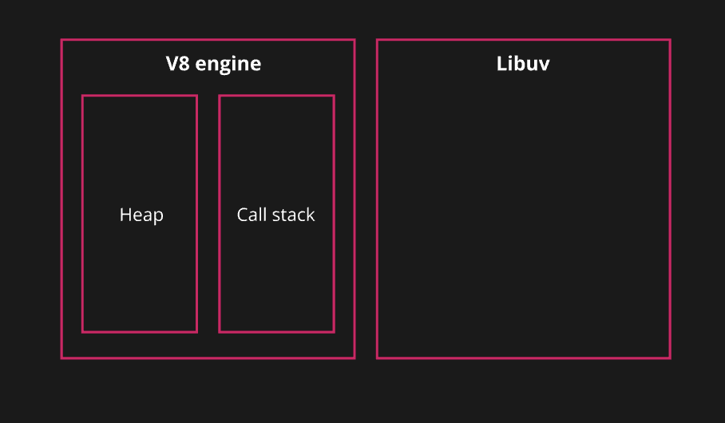
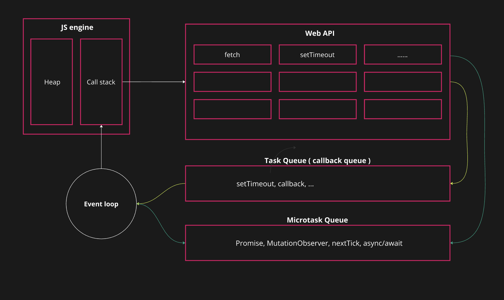
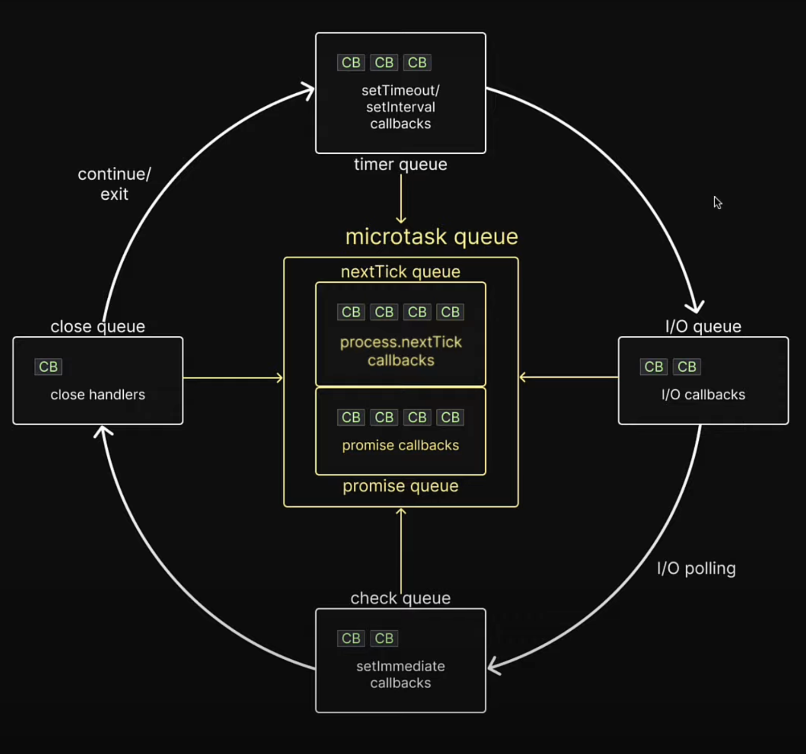

# Working of event loop

The event loop is a crucial mechanism in JavaScript that enables asynchronous programming. It ensures that non-blocking operations (like I/O, network requests, or timers) are executed efficiently, allowing JavaScript to remain responsive, even when some tasks take time to complete.

* **Single-Threaded**: JavaScript is single-threaded, so it can only do one thing at a time
* **Synchronous**: code runs in a sequence, meaning one operation is executed after the previous one completes
* **Asynchronous**: allows other operations to run while waiting for an operation to complete.



Async operations will offload to Libuv. Libuv will run the task using native  async mechanism of OS, if it is not possible then it uses the threadpool to run the task and ensuring that the main thread is not blocked.  

* **On Unix-like systems (Linux, macOS, etc.)**: it might use epoll, kqueue, or select to efficiently monitor file descriptors.
* **On Windows, it uses I/O Completion Ports (IOCP)**: a native mechanism that allows high-performance, asynchronous I/O operations.
* **Thread Pool**: If the operation cannot be handled natively by the OS asynchronously, libuv offloads the task to a thread pool (by default, the thread pool has 4 threads). The thread pool handles potentially blocking operations (like file I/O, DNS lookups) in the background, so the main thread is free to continue executing other tasks.


> Event loop written in C program that orchestrates or co-ordinates the execution of sync and async code in node js. it co-ordinares the execution of callbacks in six ques, they are **nextTick,Promise, timer, i/o, check, close**.

## Key Components

### Call Stack

The call stack manages the execution of functions. Whenever a function is invoked, it is added to the stack, and once the function completes, it is removed (LIFO—Last In, First Out).

* Manages function execution contexts
* Follows LIFO (Last In, First Out)
* Stores primitives and function calls
* Typically small in size
* Automatically grows/shrinks as functions execute

### Heap

The heap is an area of unstructured memory used for storing objects and reference types. Unlike the call stack, the heap does not follow a specific order. Objects are stored in the heap and accessed through references.

* Stores objects and reference types
* Unstructured memory allocation
* Stores objects and reference types
* Larger, used for dynamic memory
* Memory management is done through garbage collection, which automatically frees memory when objects are no longer in use.

### Web API/Node.js API

When an asynchronous operation like setTimeout, HTTP request, or file reading is triggered, it gets delegated to the Web APIs (browser environment) or Node.js APIs (server environment). These APIs handle the task in the background.

### Task Queue ( Callback Queue )

When an asynchronous task completes (like a timer, network request, or I/O operation), its callback is added to the task queue. These callbacks are waiting to be executed when the call stack is clear.

### Microtask Queue

This queue is used for tasks like resolved Promises or process.nextTick() (in Node.js). **Microtasks have higher priority than tasks in the task queue**. The microtask queue is always processed first before moving on to the task queue.  
It process only:  

* When a Promise is resolved or rejected, its **.then(), .catch(), or .finally()** callbacks are pushed to the microtask queue.
* **MutationObserver**: This is a built-in JavaScript object that watches for changes in the DOM and triggers callbacks when mutations occur
* In Node.js, **process.nextTick()** is a function that schedules a callback to be executed after the current operation completes but before the event loop continues.
* The **async/await** syntax, which is based on Promises,

### Event loop

The event loop is a loop that constantly checks if the call stack is empty. If the call stack is empty, the event loop looks for pending tasks in the microtask queue and then the task queue. It pulls tasks from these queues and pushes them onto the call stack for execution.

## Javascript runtime:


## Working

### Synchronous Function Execution

* Functions are added to the call stack as they are invoked.
* The JavaScript engine executes them one by one in a last-in, first-out (LIFO) order.
* When a function completes, it is popped off the stack.

### Asynchronous Operation

* An asynchronous function (like setTimeout, fetch, or event listeners) is pushed onto the call stack
* The JavaScript engine recognizes it as an asynchronous operation and offloads the actual processing to the Web APIs (in browsers) or Node.js APIs (in a server environment).
* The function is popped off the call stack immediately after being handed off to the Web API, allowing the JavaScript engine to continue executing synchronous code.
* Once the asynchronous operation completes, its associated callback function is pushed into  
  * Microtask queue: tasks like resolved Promises, MutationObserver, ...
  * Task queue: for tasks like setTimeout, setInterval, or I/O operations, ...
* The event loop continuously checks the call stack
* If the call stack is empty, The event loop first looks into the microtask queue. and If there are any microtasks, they are pushed to the call stack and executed.
* The event loop processes all microtasks in the queue before moving to the task queue.
* After processing the microtask queue, the event loop checks the task queue (callback queue).
* It picks the first task in the queue, pushes it to the call stack, and executes it.
* This continues until the call stack is clear and the task queue is empty.

## Execution Order

1. Any callback in the microtask queue. First task in the nextTick queue, Then Promise Queue
2. Any callback in the timer queue
3. Any callback in the microtask queue. First task in the nextTick queue, Then Promise Queue
4. All callbacks in the i/o queue
5. Any callback in the microtask queue. First task in the nextTick queue, Then Promise Queue
6. all callbacks in the check queue
7. Any callback in the microtask queue. First task in the nextTick queue, Then Promise Queue
8. all callbacks in the close queue
9. for final time in the same queue, Any callback in the microtask queue . First task in the nextTick queue, Then Promise Queue.



> if there are more callbacks to execute, then the loop kept alive for one more run and the same steps are repeated. if all callbacks executed and there is no more code to execute, then thhe event loop exits.  

**Note:**

* Before executing the task queue, event loop will ensure that the call stack and microtask queue are empty.
* Before executing the microtask queue, event loop will ensure that the call stack is empty.

### Examples

``` javascript
console.log("start")
setTimeout(()=>console.log("this is setTimeout"),0)
Promise.resolve().then(()=>console.log("this is promise"))
process.nextTick(()=>console.log("this is nextTick"))
console.log("end")
// result: 
//  start  
//  end  
//  this is nextTick  
//  this is promise 
//  this is setTimeout
```

```javascript
setTimeout(() => console.log("setTimeout 1"), 0)
setTimeout(() => {
    console.log("setTimeout 2")
    Promise.resolve().then(() => console.log("promise inside setTimeout 2"))
    process.nextTick(() => console.log("nextTick - inside setTimeout 2"))
}, 0)
setTimeout(() => console.log("setTimeout 3"), 0)

process.nextTick(() => console.log("nextTick 1"))
process.nextTick(() => {
    console.log("nextTick 2")
    process.nextTick(() => console.log("nextTick - inside nextTick 2"))
})
process.nextTick(() => console.log("nextTick 4"))

Promise.resolve().then(() => console.log("promise 1"))
Promise.resolve().then(() => {
    console.log("promise 2")
    process.nextTick(() => console.log("nextTick inside promise 2"))
})
Promise.resolve().then(() => console.log("promise 3"))
// result:
// nextTick 1
// nextTick 2
// nextTick 3
// nextTick - inside nextTick 2
// promise 1
// promise 2
// promise 3
// nextTick inside promise 2
// setTimeout 1
// setTimeout 2
// nextTick - inside setTimeout 2
// promise inside setTimeout 2
// setTimeout 3
```

```javascript
const fs=require("fs")
fs.readFile("./helper.md",()=>{
    console.log("file reader")
})
process.nextTick(() => console.log("nextTick "))
Promise.resolve().then(() => console.log("promise "))
// result: 
// nextTick 
// promise 
// file reader
```

```javascript
const fs=require("fs")
setTimeout(() => console.log("setTimeout "), 0)
fs.readFile("./helper.md",()=>{
    console.log("file reader")
})
// result:
// file reader
// setTimeout 
// or
// setTimeout 
// file reader
```

in the above case output is not consistent. when running setTimeout with delay 0ms and an i/o async method, the order of excution can never be guaranteed. becouse if you set 0ms delay, it overrides to 1ms (setTimeout will take max of 1ms and the passed delay.so here the passed delay is 0ms. so it will take 1ms). So if the file read before 1ms, then the timer callback hasn't been moved into timer queue. So i/o callback will execute first in this case.

```javascript
const fs=require("fs")
fs.readFile("./helper.md",()=>{
    console.log("file reader")
})
process.nextTick(() => console.log("nextTick "))
Promise.resolve().then(() => console.log("promise "))
setTimeout(() => console.log("setTimeout "), 0)
// result: 
// nextTick 
// promise 
// setTimeout 
// file reader
```

```javascript
const fs=require("fs")
fs.readFile("./helper.md",()=>{
    console.log("file reader")
})
setTimeout(() => console.log("setTimeout "), 0)
setImmediate(() => console.log("setImmediate "))
process.nextTick(() => console.log("nextTick "))
Promise.resolve().then(() => console.log("promise "))

// result: 
// nextTick 
// promise 
// setTimeout 
// setImmediate 
// file reader
```

in above case setImmediate callback execute before i/o callback. becouse  I/O operations are polled and callback functions are added to the I/O queue only after the I/O is complete. So the i/o callback considered in the next iteration of event loop.

```javascript
setTimeout(() => console.log("setTimeout "), 0)
setImmediate(() => console.log("setImmediate "))

// result: 
// setTimeout
// setImmediate
// or
// setImmediate
// setTimeout
```

in the above case output is not consistent. when running setTimeout with delay 0ms and setImmediate method, the order of execution can never be guaranteed. Becouse if you set 0ms delay, it overrides to 1ms (setTimeout will take max of 1ms and the passed delay.so here the passed delay is 0ms. so it will take 1ms).

```javascript
const fs=require("fs")
fs.readFile("./helper.md",()=>{
    console.log("file reader")
    setImmediate(() => console.log("setImmediate - inside file reader"))
})
setTimeout(() => console.log("setTimeout "), 0)
setImmediate(() => console.log("setImmediate "))
process.nextTick(() => console.log("nextTick "))
Promise.resolve().then(() => console.log("promise "))

// result: 
// nextTick 
// promise 
// setTimeout 
// setImmediate 
// file reader
// setImmediate - inside file reader
```

```javascript
const fs = require("fs")
fs.readFile("./index.js", () => {
    console.log("file reader")
    setImmediate(() => console.log("setImmediate inside file reader"))
    process.nextTick(() => console.log("nextTick inside file reader"))
    Promise.resolve().then(() => console.log("promise inside file reader"))
})
setTimeout(() => console.log("setTimeout "), 0)
setImmediate(() => console.log("setImmediate "))
process.nextTick(() => console.log("nextTick "))
Promise.resolve().then(() => console.log("promise "))

// result: 
// nextTick 
// promise 
// setTimeout 
// setImmediate 
// file reader
// nextTick inside file reader
// promise inside file reader
// setImmediate inside file reader
```

```javascript
const fs = require("fs")
setImmediate(() => console.log("setImmediate 1"))
setImmediate(() => {
    console.log("setImmediate 2")
    process.nextTick(() => console.log("nextTick inside setImmediate 2"))
    Promise.resolve().then(() => console.log("promise inside setImmediate 2"))
})
setImmediate(() => console.log("setImmediate 3"))
// result: 
// setImmediate 1
// setImmediate 2
// nextTick inside setImmediate 2
// promise inside setImmediate 2
// setImmediate 3
```

```javascript
const fs = require("fs")
const read  = fs.createReadStream("./index.js")
read.close()
read.on("close",()=>{
    console.log("read close");
})
setTimeout(() => console.log("setTimeout "), 0)
setImmediate(() => console.log("setImmediate"))
process.nextTick(() => console.log("nextTick "))
Promise.resolve().then(() => console.log("promise "))
// result: 
// nextTick 
// promise 
// setTimeout 
// setImmediate
// read close
```

close callback will execut after all the callbacks executed.
