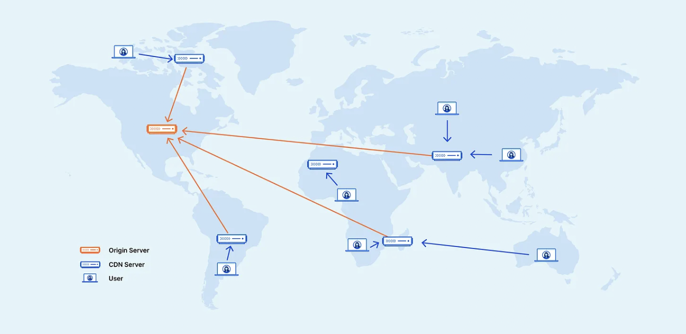

# Scalability

The ability of a system to accommodate a growing load or demand without compromising performance is referred to as scalability.

**System can grow in several dimensions**, like  

1. More Users: Increased the number of users
2. More features: More features were introduced to expand the system
3. More Data: Growth in the amount of data the system stores and manages due to user activity or logging
4. More Complexity: The system's architecture evolves to accommodate new features, scale, or integrations, resulting in additional components and dependencies
5. More Geographics: The system is expanded to serve users in new regions or countries

## How to Scale a System

### Vertical Scaling (Scale up)

upgrading existing server with more RAM, faster CPUs, or additional storage.

### Horizontal Scaling (Scale out)

adding more machines to your system to spread the workload across multiple servers

### Load Balancing

Load balancing is the process of distributing traffic across multiple servers to ensure no single server becomes overwhelmed

### Caching

store frequently accessed data in-memory (like RAM) to reduce the load on the server or database

### Content Delivery Networks (CDNs)

CDN distributes static assets (images, videos, etc.) closer to users. This can reduce latency and result in faster load times.

### Sharding/Partitioning

Partitioning means splitting data or functionality across multiple nodes/servers to distribute workload and avoid bottlenecks.  

### Asynchronous communication

Asynchronous communication means deferring long-running or non-critical tasks to background queues or message brokers..

### Microservices Architecture

Micro-services architecture breaks down application into smaller, independent services that can be scaled independently.

### Auto-Scaling

Auto-Scaling means automatically adjusting the number of active servers based on the current load.

